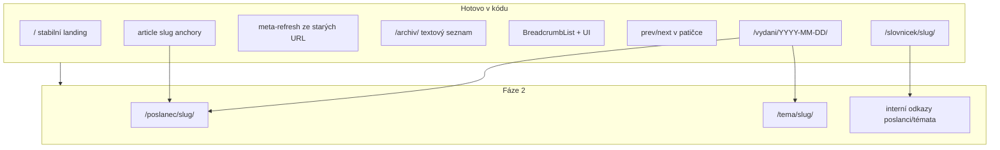

# SEO redesign poslusnehlasim.cz — implementační plán

**Verze:** 1.5 · 10. 7. 2026  
**Zdrojová specifikace:** [`seo-redisgn.md`](seo-redisgn.md)  
**Přehled:** Implementace SEO redesignu ve třech fázích podle specifikace. **Hotovo v kódu:** Fáze 0 (0.1–0.3), **celá Fáze 1** (1.1–1.6). **Zbývá:** Fáze 2 (entity stránky). Nasazení: `./run-svejk.sh export-pages` → deploy `site/`.

## Stav kódu vs. spec (ověření ⚠️)

| Bod spec | Skutečný stav | Poznámka |
|---|---|---|
| Kanonické URL vydání | **Hotovo (1.1)** | `/vydani/{YYYY-MM-DD}/` ([`urls.py`](../svejk/build/urls.py), [`nav.py`](../svejk/build/nav.py)); staré `/noviny/…` → meta-refresh stub |
| Steno `/vydani/…/steno/` | **Hotovo (1.1)** | `steno_sources_pages_href()` + export podstránek |
| Homepage = dnešní vydání | **Hotovo (1.2)** | Plný obsah na `/` ([`export_pages.py`](../svejk/build/export_pages.py), `is_homepage=True`); titulek dne nahoře (H2), stabilní SEO H1 dole pod archivem |
| Title/meta šablony §4–5 | **Hotovo (0.1)** | [`seo.py`](../svejk/build/seo.py): `homepage_page_title()`, `edition_page_title()`, `edition_meta_description()` |
| H1/H2 struktura | **Hotovo (1.2)** | Homepage: H2 titulek dne nahoře + H1 (`Poslušně hlásím…`) dole v [`homepage-archive.html`](../svejk/templates/homepage-archive.html); vydání: H1 titulek dne ([`edition-day-headline.html`](../svejk/templates/edition-day-headline.html)) |
| Duplicita obsahu `/` vs. vydání | **Částečně (1.2)** | Text stále shodný, canonical na obou stránkách na sebe; odlišná nadpisová hierarchie snižuje riziko |
| HTTP 301 redirecty | **Částečně (1.1)** | Meta-refresh stuby v [`_redirect_html()`](../svejk/build/export_pages.py) — **záměrně**, HTTP 301 až přes Cloudflare |
| Archiv crawlovatelný | **Hotovo (0.3)** | Chipy + textový seznam „Všechna vydání" ([`archive_text_list()`](../svejk/build/nav.py), [`archiv.html`](../svejk/templates/archiv.html)) |
| Sekce „Z archivu" na homepage | **Hotovo (1.2)** | 5 předchozích vydání ([`homepage-archive.html`](../svejk/templates/homepage-archive.html), `homepage_archive_list()`) |
| `<time datetime>` u vydání | **Hotovo (1.2)** | V meta řádku pod titulkem dne |
| JSON-LD | **Hotovo (0.2 + 1.5 + 1.6)** | `#org`, `website_json_ld`, `article_json_ld` s `about` a `hasPart` s fragment URL; `faq_json_ld` na indexu slovníčku; `slovnicek_term_json_ld` na pojmech |
| Logo URL v schema | **Odchylka** | `/static/apple-touch-icon.png` (spec `/assets/logo.png` neexistuje, záměrně ponecháno) |
| Slovníček per-pojem | **Hotovo (1.5)** | `/slovnicek/{slug}/` ([`slovnicek-pojem.html`](../svejk/templates/slovnicek-pojem.html), [`slovnicek_index.py`](../svejk/build/slovnicek_index.py)); index odkazuje na per-pojem URL |
| Article anchory | **Hotovo (1.6)** | `DenItem.anchor_id` → `#slug` v [`card-article.html`](../svejk/templates/card-article.html); `edition_article_href()` v [`urls.py`](../svejk/build/urls.py) |
| Poslanec/téma entity | **Chybí (Fáze 2)** | Slugy témat v `aligned/topics.json`; poslanci v [`psp/poslanci.py`](../psp/poslanci.py), bez stránek |
| Breadcrumbs | **Hotovo (1.3 + 1.5)** | UI + `BreadcrumbList` JSON-LD včetně stránek pojmů slovníčku |

---

## Rozhodnutí (potvrzeno)

- **Homepage UX:** plné vydání na `/`; titulek dne = H2 nahoře (hlavní vizuální nadpis); stabilní SEO H1 (`Poslušně hlásím, satirický deník…`) až dole pod „Celý archiv →" (**Poslušně hlásím** tučně). Na stránce vydání H1 = titulek dne.
- **Redirecty:** zatím meta-refresh (ne HTTP 301). Spec §3 splněn jen částečně — později doplnit Cloudflare Bulk Redirect Rules bez migrace hostingu.

---

## Fáze 0 — hotovo (9. 7. 2026)

### 0.1 Title/meta dle spec §4–5 — hotovo

Implementováno v [`seo.py`](../svejk/build/seo.py), testy v [`tests/test_seo.py`](../tests/test_seo.py):

| Stránka | Šablona (nasazeno) |
|---|---|
| Homepage title | `Poslušně hlásím, denní zpravodaj z Poslanecké sněmovny` |
| Homepage meta | `Satirický deník z Poslanecké sněmovny. Každý jednací den srozumitelně: …` |
| Vydání title | `Sněmovna {D. M. YYYY}: {Titulek} \| Poslušně hlásím` |
| Vydání meta | `{Perex}. Denní přehled z Poslanecké sněmovny, {datum}.` |

### 0.2 JSON-LD dle spec §9 — hotovo

- `@id` organizace: `#org`
- `ORGANIZATION_DESCRIPTION` a `WEBSITE_SCHEMA_NAME` v [`seo.py`](../svejk/build/seo.py)
- `NewsArticle`: `about` Thing, `author`/`publisher` přes `@id`, `datePublished` s `+02:00`
- Logo: `/static/apple-touch-icon.png` (odchylka od spec)
- `/o-webu/` má vlastní meta + `website_json_ld` (dřívější práce)

### 0.3 Archiv — textový seznam — hotovo

- `archive_text_list()` v [`nav.py`](../svejk/build/nav.py)
- Sekce „Všechna vydání" v [`archiv.html`](../svejk/templates/archiv.html)
- Styly v [`noviny-dlouhe.css`](../svejk/static/noviny-dlouhe.css)

### Dříve hotová infra (bez změny URL)

- Stabilní homepage `<title>` (oddělený od `og:title` při sdílení)
- `sitemap.xml`, `robots.txt`, `llms.txt` generované v exportu
- FAQPage JSON-LD na indexu slovníčku

### 0.4 Mimo kód (Markéta) — otevřeno

- [ ] GSC ověření, odeslání sitemap, URL Inspection — dle spec §12
- [ ] Po deployi: Rich Results Test na homepage, vydání, slovníček (index + pojem)

**Nasazení:** `./run-svejk.sh export-pages` → deploy `site/`

---

## Fáze 1 — restrukturalizace — hotovo (10. 7. 2026)

### 1.1 Nové URL schéma — hotovo

- [`svejk/build/urls.py`](../svejk/build/urls.py): konverze dat, slugy, export cesty, legacy href
- [`nav.py`](../svejk/build/nav.py): kanonické URL `/vydani/{ISO}/`, `/archiv/`, `/slovnicek/`, podstránky `/steno/`, …
- [`export_pages.py`](../svejk/build/export_pages.py): export do `vydani/…/index.html`, meta-refresh stuby ze starých `/noviny/…`
- [`seo.py`](../svejk/build/seo.py): sitemap s novými URL, deduplikace po dni
- Testy: [`tests/test_urls.py`](../tests/test_urls.py), [`tests/test_seo.py`](../tests/test_seo.py)

### 1.2 Homepage jako stabilní landing (§4) — hotovo

- [`homepage-archive.html`](../svejk/templates/homepage-archive.html): sekce „Z archivu" (`homepage_archive_list()`, 5 vydání), odkaz „Celý archiv →", stabilní SEO H1 dole (`h1_lead` + `h1_tail` ve [`strings.json`](../svejk/strings.json))
- [`edition-day-headline.html`](../svejk/templates/edition-day-headline.html): H2 na homepage, H1 na vydání + meta řádek s `<time>`
- [`edition-masthead.html`](../svejk/templates/edition-masthead.html): dekorativní masthead (`
`), H1 na titulku dne
- [`html.py`](../svejk/build/html.py): kontext `is_homepage`, `edition_day_headline`, `homepage_archive`
- Canonical: `/` self-canonical, vydání na `/vydani/…`
- Testy: [`tests/test_homepage.py`](../tests/test_homepage.py)

### 1.3 Breadcrumbs + schema — hotovo

- [`breadcrumbs.html`](../svejk/templates/breadcrumbs.html) + [`breadcrumb-jsonld.html`](../svejk/templates/breadcrumb-jsonld.html)
- [`seo.py`](../svejk/build/seo.py): `breadcrumb_json_ld()`, `breadcrumbs_ctx_*()` pro archiv, vydání, podstránky, slovníček
- Vloženo do vydání (ne homepage), archivu, slovníčku, steno/smlouvy/řečníci/vyznamenání
- Testy: [`tests/test_seo.py`](../tests/test_seo.py)

### 1.4 Prev/next prolinkování — hotovo

- Sdílená šablona [`edition-pager.html`](../svejk/templates/edition-pager.html) (masthead mobile, desktop, patička vydání)
- Patička vydání: `← datum | datum →` nad odběrem ([`edition-footer.html`](../svejk/templates/edition-footer.html))
- `edition_nav()` generuje kanonické `/vydani/{ISO}/` URL (`link_mode="pages"`)
- Testy: [`tests/test_nav.py`](../tests/test_nav.py)

### 1.5 Slovníček — samostatné stránky (§7) — hotovo

- Export `/slovnicek/{slug}/index.html` pro každý pojem ze `SLOVNIČEK` v [`glossary.py`](../svejk/glossary.py) (`slovnicek_term_slug()`)
- Šablona [`slovnicek-pojem.html`](../svejk/templates/slovnicek-pojem.html): H1 `Co je {pojem}?`, definice, sekce „Kde se o tom psalo"
- Index [`slovnicek-stranka.html`](../svejk/templates/slovnicek-stranka.html): odkazy na per-pojem URL (`term-link`), bez kotev a modalu
- [`slovnicek_index.py`](../svejk/build/slovnicek_index.py): build-time index zmínek (až 8 nejnovějších vydání na pojem)
- [`seo.py`](../svejk/build/seo.py): `defined_term_json_ld()`, `slovnicek_term_json_ld()`, `slovnicek_term_page_title()`, `breadcrumbs_ctx_slovnicek_term()`
- [`glossary_markup.py`](../svejk/build/glossary_markup.py): pojmy slovníčku → `<a class="term-term" href="/slovnicek/{slug}/">` (modal přes `preventDefault` jako progressive enhancement)
- Sitemap: URL všech pojmů v `write_sitemap_xml()`
- Title pojmu: `Co je {pojem}? Švejkov slovníček | Poslušně hlásím` (odchylka od spec „Sněmovní slovníček")

### 1.6 Article anchory pro deep-linky — hotovo

- [`DenItem.anchor_id`](../svejk/build/day_content.py): slug z `topic_slugs`, fallback `article-{num}`
- [`card-article.html`](../svejk/templates/card-article.html): `id="{{ item.anchor_id }}"` (např. `#novela-z-o-obalech`)
- [`card-citace.html`](../svejk/templates/card-citace.html): `id="{{ item.anchor_id }}-citace"`
- [`urls.py`](../svejk/build/urls.py): `article_anchor_id()`, `edition_article_href()` pro budoucí entity odkazy
- `article_json_ld` `hasPart`: každá část má `@id` a `url` s fragmentem (`…/vydani/2026-07-02/#slug`)
- CSS: `.article:target { scroll-margin-top: 24px }`
- Testy: [`tests/test_urls.py`](../tests/test_urls.py), [`tests/test_seo.py`](../tests/test_seo.py)

---

## Fáze 2 — entitní stránky (~2–4 týdny) — zbývá

### 2.1 Index zmínek (build-time)

Nový modul `svejk/build/entity_index.py`:

- **Poslanci:** projít všechna vydání + `steno.jsonl` (`cele_jmeno`), párovat přes `PoslanecRegistry`, agregovat `(datum, article_slug, excerpt, anchor)`
- **Témata:** z `facts/by_topic/*.json` + `topics.json` slugy
- Výstup: `processed/entity-index.json` (cache pro rychlý rebuild)
- Anchor pro deep-linky už existuje: `edition_article_href(datum, slug=…)` z 1.6

### 2.2 `/poslanec/{slug}/` (§6)

- Generovat jen při ≥ 3 zmínkách
- Šablona `poslanec-stranka.html`: H1, strojový úvod, chronologický seznam s odkazy na `/vydani/{date}/#{anchor_id}`
- Title dle spec
- `poslanec_slug()` už v [`urls.py`](../svejk/build/urls.py)

### 2.3 `/tema/{slug}/` (§6)

- Kurátorovaný seznam 10–20 témat (config soubor `svejk/temata_curated.json` nebo flag v `topics.json`)
- Stejná struktura jako poslanec, data z `facts/by_topic/{slug}.json`

### 2.4 Index stránky `/poslanci/` a `/temata/`

- Abecední seznam s počtem zmínek
- Přidat do [`site-nav.html`](../svejk/templates/site-nav.html)

### 2.5 Interní prolinkování (§8)

Rozšířit [`glossary_markup.py`](../svejk/build/glossary_markup.py) a/nebo nový post-process `link_entities()`:

1. První výskyt poslance → `<a href="/poslanec/{slug}/">` (jen pokud stránka existuje)
2. První výskyt tématu → `<a href="/tema/{slug}/">`
3. ~~Pojmy slovníčku → `<a href="/slovnicek/{slug}/">`~~ **hotovo (1.5)**
4. Build-time orphan check: každá generovaná stránka musí mít ≥ 1 příchozí odkaz (jinak warning/fail exportu)

---

## Technické požadavky (§11) — checklist

| Položka | Kde | Stav |
|---|---|---|
| `sitemap.xml` s novými URL | [`seo.py`](../svejk/build/seo.py) `write_sitemap_xml()` | ✅ 1.1 + pojmy slovníčku (1.5) |
| Canonical absolutní HTTPS + trailing slash | [`html.py`](../svejk/build/html.py) | ✅ |
| `<time datetime>` u vydání | [`edition-day-headline.html`](../svejk/templates/edition-day-headline.html) | ✅ 1.2 |
| Breadcrumbs UI + JSON-LD | [`breadcrumbs.html`](../svejk/templates/breadcrumbs.html), [`seo.py`](../svejk/build/seo.py) | ✅ 1.3 + pojmy (1.5) |
| DefinedTerm + FAQ na pojmech slovníčku | [`seo.py`](../svejk/build/seo.py), [`slovnicek-pojem.html`](../svejk/templates/slovnicek-pojem.html) | ✅ 1.5 |
| Article fragment URL v `hasPart` | [`seo.py`](../svejk/build/seo.py) `article_json_ld()` | ✅ 1.6 |
| `llms.txt` aktualizace | [`write_llms_txt()`](../svejk/build/seo.py) | ✅ |
| OG per-page | `og-meta.html` | ✅ |
| `<html lang="cs">` | šablony | ✅ |

---

## Rizika a odchylky od spec

1. **Meta-refresh ≠ HTTP 301:** Google je zpracuje pomaleji a hůř než 301. Až bude čas, doplnit Cloudflare Bulk Redirect Rules ([`infra/cloudflare/README.md`](../infra/cloudflare/README.md) — doména už jde přes CF proxy) bez migrace z GitHub Pages.
2. **Dvojí URL vydání + homepage:** canonical na obou stránkách na sebe + odlišné H1/H2 sníží duplicitu, ale obsah zůstane shodný — akceptovatelné dle výběru.
3. **Schůze v URL:** nové URL používají jen ISO datum; při více schůzích v jeden den zůstane `resolve_edition()` (poslední schůze) — dokumentovat v `/o-webu/`.
4. **Off-page SEO (§14):** mimo scope developer — backlinky řeší Markéta.
5. **Slovníček title / DefinedTermSet název:** v kódu „Švejkov slovníček", spec §7 „Sněmovní slovníček" — záměrná značka webu.

---

## Doporučené pořadí implementace

1. ~~Fáze 0.1–0.3~~ **hotovo**
2. ~~Fáze 1.1~~ **hotovo** — URL helpery, export, meta-refresh stuby
3. ~~Fáze 1.2~~ **hotovo** — homepage landing, H1/H2 logika, „Z archivu"
4. ~~Fáze 1.3~~ **hotovo** — breadcrumbs UI + BreadcrumbList JSON-LD
5. ~~Fáze 1.4~~ **hotovo** — prev/next v patičce, `/vydani/` URL v pageru
6. ~~Fáze 1.5~~ **hotovo** — slovníček split, DefinedTerm, odkazy v textech
7. ~~Fáze 1.6~~ **hotovo** — article slug anchory, `hasPart` fragmenty
8. **Fáze 2.1** entity index → 2.2–2.5

**Testy:** [`tests/test_seo.py`](../tests/test_seo.py) (30 testů: title, JSON-LD, breadcrumbs, sitemap, anchory), [`tests/test_urls.py`](../tests/test_urls.py), [`tests/test_homepage.py`](../tests/test_homepage.py), [`tests/test_nav.py`](../tests/test_nav.py). Ve Fázi 2 přidat `tests/test_entity_index.py`.

**Akceptační kritéria:** Rich Results Test bez chyb; `site:poslusnehlasim.cz` s novým title; staré URL vrací redirect (meta-refresh minimálně, 301 ideálně později); žádné 404 na starých cestách.

---

## Úkoly

- [x] **Fáze 0:** Sjednotit title/meta šablony se spec §4–5 v `seo.py` + testy
- [x] **Fáze 0:** Sladit JSON-LD (Organization `#org`, popisy, NewsArticle `about`)
- [x] **Fáze 0:** Přidat textový seznam vydání do `archiv.html` (`archive_text_list`)
- [ ] **Fáze 0:** GSC, odeslání sitemap, Rich Results Test (Markéta, po deployi)
- [x] **Fáze 1:** Nové URL schéma (`/vydani/YYYY-MM-DD/`), ISO konverze, meta-refresh stuby ze starých URL
- [x] **Fáze 1:** Stabilní homepage landing (H2 titulek dne nahoře, SEO H1 dole pod archivem, sekce Z archivu)
- [x] **Fáze 1:** Rozpad slovníčku na `/slovnicek/{slug}/` + DefinedTerm schema + odkazy v textech
- [x] **Fáze 1:** Breadcrumbs UI + BreadcrumbList JSON-LD na podstránkách
- [x] **Fáze 1:** Prev/next prolinkování vydání (pager + patička, `/vydani/` URL)
- [x] **Fáze 1:** Article slug anchory (`DenItem.anchor_id`, deep-linky `#slug`)
- [ ] **Fáze 2:** Entity index, `/poslanec/` a `/tema/` stránky, interní prolinkování, orphan check
