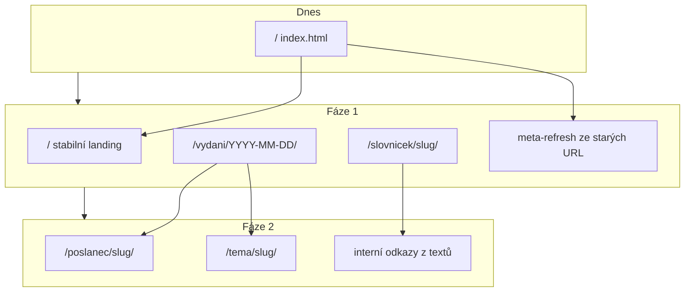

# SEO redesign poslusnehlasim.cz — implementační plán

**Verze:** 1.1 · 9. 7. 2026  
**Zdrojová specifikace:** [`seo-redisgn.md`](seo-redisgn.md)  
**Přehled:** Implementace SEO redesignu ve třech fázích podle specifikace, s vycházením z existujícího Python/Jinja build pipeline. **Fáze 0 (0.1–0.3) je hotová** (nasadit exportem). Fáze 1 přinese nové URL, stabilní homepage a rozpad slovníčku; Fáze 2 přidá entitní stránky poslanců a témat.

## Stav kódu vs. spec (ověření ⚠️)

| Bod spec | Skutečný stav | Poznámka |
|---|---|---|
| URL vydání `DD.MM.YYYY.html` | **Potvrzeno** | [`svejk/build/nav.py`](../svejk/build/nav.py) → `/noviny/{obdobi}/{schuze}/{datum_unl}.html` |
| Steno `-steno.html` | **Potvrzeno** | `steno_sources_pages_href()` |
| Homepage = dnešní vydání | **Potvrzeno** | [`export_pages.py`](../svejk/build/export_pages.py) volá `render_den_html(is_homepage=True)` se šablonou [`noviny-dlouhe.html`](../svejk/templates/noviny-dlouhe.html) |
| Title/meta šablony §4–5 | **Hotovo (0.1)** | [`seo.py`](../svejk/build/seo.py): `homepage_page_title()`, `edition_page_title()`, `edition_meta_description()`, `SITE_META_DESCRIPTION` |
| Duplicita obsahu | **Problém (Fáze 1)** | Stejný HTML obsah na `/` i na edition URL; H1 je vždy „Poslušně hlásím!" ([`edition-masthead.html`](../svejk/templates/edition-masthead.html)) |
| HTTP 301 redirecty | **Chybí** | Jen meta-refresh v [`_redirect_html()`](../svejk/build/export_pages.py) — **záměrně ponecháno** dle rozhodnutí |
| Archiv crawlovatelný | **Hotovo (0.3)** | Chipy + textový seznam „Všechna vydání" s anchor textem `datum, titulek` ([`archive_text_list()`](../svejk/build/nav.py), [`archiv.html`](../svejk/templates/archiv.html)) |
| JSON-LD | **Hotovo (0.2)** | [`seo.py`](../svejk/build/seo.py): `#org`, `website_json_ld`, `article_json_ld` s `about`, `faq_json_ld` na slovníčku |
| Logo URL v schema | **Odchylka** | `/static/apple-touch-icon.png` (spec `/assets/logo.png` neexistuje, záměrně ponecháno) |
| Slovníček per-pojem | **Chybí** | Jedna stránka [`slovnicek-stranka.html`](../svejk/templates/slovnicek-stranka.html), kotvy přes `slovnicek_anchor()` |
| Poslanec/téma entity | **Data částečně** | Slugy témat v `aligned/topics.json`; poslanci anotováni v [`psp/poslanci.py`](../psp/poslanci.py), bez slug stránek |
| Breadcrumbs | **Chybí** | Žádný `BreadcrumbList` ani UI komponenta |



---

## Rozhodnutí (potvrzeno)

- **Homepage UX:** plné vydání na `/`, ale stabilní H1 jen na homepage; titulek dne = H2 na homepage, H1 na stránce vydání.
- **Redirecty:** zatím meta-refresh (ne HTTP 301). Spec §3 splněn jen částečně — později doplnit Cloudflare Bulk Redirect Rules bez migrace hostingu.

---

## Fáze 0 — hotovo (9. 7. 2026)

### 0.1 Title/meta dle spec §4–5 — hotovo

Implementováno v [`seo.py`](../svejk/build/seo.py), testy v [`tests/test_seo.py`](../tests/test_seo.py):

| Stránka | Šablona (nasazeno) |
|---|---|
| Homepage title | `Poslušně hlásím, denní zpravodaj z Poslanecké sněmovny` |
| Homepage meta | `Satirický deník z Poslanecké sněmovny. Každý jednací den srozumitelně: …` |
| Vydání title | `Sněmovna {D. M. YYYY}: {Titulek} \| Poslušně hlásím` |
| Vydání meta | `{Perex}. Denní přehled z Poslanecké sněmovny, {datum}.` |

### 0.2 JSON-LD dle spec §9 — hotovo

- `@id` organizace: `#org`
- `ORGANIZATION_DESCRIPTION` a `WEBSITE_SCHEMA_NAME` v [`seo.py`](../svejk/build/seo.py)
- `NewsArticle`: `about` Thing, `author`/`publisher` přes `@id`, `datePublished` s `+02:00`
- Logo: `/static/apple-touch-icon.png` (odchylka od spec)
- `/o-webu/` má vlastní meta + `website_json_ld` (dřívější práce)

### 0.3 Archiv — textový seznam — hotovo

- `archive_text_list()` v [`nav.py`](../svejk/build/nav.py)
- Sekce „Všechna vydání" v [`archiv.html`](../svejk/templates/archiv.html)
- Styly v [`noviny-dlouhe.css`](../svejk/static/noviny-dlouhe.css)

### Dříve hotová infra (bez změny URL)

- Stabilní homepage `<title>` (oddělený od `og:title` při sdílení)
- `sitemap.xml`, `robots.txt`, `llms.txt` generované v exportu
- FAQPage JSON-LD na slovníčku

### 0.4 Mimo kód (Markéta) — otevřeno

- [ ] GSC ověření, odeslání sitemap, URL Inspection — dle spec §12
- [ ] Po deployi: Rich Results Test na homepage a vydání

**Nasazení:** `./run-svejk.sh export-pages` → deploy `site/`

---

## Fáze 1 — restrukturalizace (~1–2 týdny)

### 1.1 Nové URL schéma — centrální refaktor

Všechny `*_href()` funkce v [`nav.py`](../svejk/build/nav.py) přepsat na nový formát:

```
/vydani/{YYYY-MM-DD}/           (místo /noviny/{obdobi}/{schuze}/{DD.MM.YYYY}.html)
/vydani/{YYYY-MM-DD}/steno/     (místo -steno.html)
/archiv/                        (místo /archiv.html)
/slovnicek/                     (místo /slovnicek.html)
/slovnicek/{slug}/              (nové)
```

**Pomocné funkce** (nový modul `svejk/build/urls.py` nebo rozšíření `nav.py`):

- `datum_unl_to_iso("08.07.2026")` → `"2026-07-08"`
- `datum_iso_to_unl("2026-07-08")` → `"08.07.2026"`
- `edition_slug(edition)` → ISO datum (schůze řešit přes `resolve_edition()` jako dnes)
- `poslanec_slug(jmeno, prijmeni)` → `andrej-babis` (reuse logika z [`align.py`](../svejk/build/align.py) `_slug()`)

**Export** ([`export_pages.py`](../svejk/build/export_pages.py)):

- Zapisovat `site/vydani/2026-07-08/index.html` (trailing slash konvence)
- Paralelně generovat staré cesty jako meta-refresh stuby (kompletní mapa dle spec §3 + všechny podstránky: `-recnici`, `-smlouvy`, vyznamenani)
- Aktualizovat [`write_sitemap_xml()`](../svejk/build/seo.py) na nové URL

### 1.2 Homepage jako stabilní landing (§4)

Nová šablona nebo podmíněné bloky v [`noviny-dlouhe.html`](../svejk/templates/noviny-dlouhe.html) pro `is_homepage`:

1. **Stabilní H1** nad obsahem: „Poslušně hlásím, satirický deník Poslanecké sněmovny" + 1–2 věty úvodu (klíčová slova)
2. **Masthead** ([`edition-masthead.html`](../svejk/templates/edition-masthead.html)): na homepage `<p>` místo `<h1>`; na vydání ponechat brand masthead jako dekoraci, H1 přesunout na titulek dne
3. **Titulek dne**: nový blok `edition-day-headline.html` — na homepage `<h2>`, na vydání `<h1>` + řádek „Poslanecká sněmovna, {den} {datum} · {n}. schůze" + `<time datetime="…">`
4. **Sekce „Z archivu"**: 5 posledních vydání (`archive_recent(limit=5)`) s titulky jako odkazy
5. **Canonical**: `/` zůstává self-canonical; vydání self-canonical na `/vydani/…`

### 1.3 Breadcrumbs + schema

- Nová šablona `breadcrumbs.html` + helper `breadcrumb_json_ld()` v [`seo.py`](../svejk/build/seo.py)
- Vložit do vydání, archivu, slovníčku, podstránek vydání
- Příklad: `Poslušně hlásím › Archiv › 8. 7. 2026`

### 1.4 Prev/next prolinkování

Pager v [`edition-rail.html`](../svejk/templates/edition-rail.html) a [`edition-footer.html`](../svejk/templates/edition-footer.html) už existuje — ověřit, že funguje s novými URL a je viditelný i v patičce vydání (spec požaduje `← předchozí | další →`).

### 1.5 Slovníček — samostatné stránky (§7)

- Exportovat pro každý termín ze `SLOVNIČEK` v [`glossary.py`](../svejk/glossary.py) stránku `/slovnicek/{slug}/`
- Nová šablona `slovnicek-pojem.html`: H1 `Co je {pojem}?`, definice, satirický dovětek, sekce „Kde se o tom psalo" (průchod vydáními — grep přes `glossary_markup` nebo index zmínek)
- Index [`slovnicek-stranka.html`](../svejk/templates/slovnicek-stranka.html): odkazy na per-pojem URL místo kotev
- `defined_term_json_ld()` + `faq_json_ld()` dle spec §9
- Upravit [`glossary_markup.py`](../svejk/build/glossary_markup.py): tooltip tlačítka obalit `<a href="/slovnicek/{slug}/">` (JS modal jako progressive enhancement)

### 1.6 Article anchory pro deep-linky

V [`card-article.html`](../svejk/templates/card-article.html): `id="article-{{ item.num }}"` → `id="{{ item.slug }}"` (slug z `DenItem.slug`, už existuje v pipeline).

---

## Fáze 2 — entitní stránky (~2–4 týdny)

### 2.1 Index zmínek (build-time)

Nový modul `svejk/build/entity_index.py`:

- **Poslanci:** projít všechna vydání + `steno.jsonl` (`cele_jmeno`), párovat přes `PoslanecRegistry`, agregovat `(datum, article_slug, excerpt, anchor)`
- **Témata:** z `facts/by_topic/*.json` + `topics.json` slugy
- Výstup: `processed/entity-index.json` (cache pro rychlý rebuild)

### 2.2 `/poslanec/{slug}/` (§6)

- Generovat jen při ≥ 3 zmínkách
- Šablona `poslanec-stranka.html`: H1, strojový úvod, chronologický seznam s odkazy na `/vydani/{date}/#{slug}`
- Title dle spec
- Přidat `poslanec_slug()` do [`psp/poslanci.py`](../psp/poslanci.py)

### 2.3 `/tema/{slug}/` (§6)

- Kurátorovaný seznam 10–20 témat (config soubor `svejk/temata_curated.json` nebo flag v `topics.json`)
- Stejná struktura jako poslanec, data z `facts/by_topic/{slug}.json`

### 2.4 Index stránky `/poslanci/` a `/temata/`

- Abecední seznam s počtem zmínek
- Přidat do [`site-nav.html`](../svejk/templates/site-nav.html)

### 2.5 Interní prolinkování (§8)

Rozšířit [`glossary_markup.py`](../svejk/build/glossary_markup.py) a/nebo nový post-process `link_entities()`:

1. První výskyt poslance → `<a href="/poslanec/{slug}/">` (jen pokud stránka existuje)
2. První výskyt tématu → `<a href="/tema/{slug}/">`
3. Pojmy slovníčku → `<a href="/slovnicek/{slug}/">` (nahradí čisté buttony)
4. Build-time orphan check: každá generovaná stránka musí mít ≥ 1 příchozí odkaz (jinak warning/fail exportu)

---

## Technické požadavky (§11) — checklist

| Položka | Kde |
|---|---|
| `sitemap.xml` s novými URL | [`seo.py`](../svejk/build/seo.py) `write_sitemap_xml()` |
| Canonical absolutní HTTPS + trailing slash | [`html.py`](../svejk/build/html.py) `_og_context()` |
| `<time datetime>` u vydání | nový headline blok |
| `llms.txt` aktualizace | [`write_llms_txt()`](../svejk/build/seo.py) |
| OG per-page | už existuje přes `og-meta.html` — ověřit na nových stránkách |
| `<html lang="cs">` | už všude |

---

## Rizika a odchylky od spec

1. **Meta-refresh ≠ HTTP 301:** Google je zpracuje pomaleji a hůř než 301. Až bude čas, doplnit Cloudflare Bulk Redirect Rules ([`infra/cloudflare/README.md`](../infra/cloudflare/README.md) — doména už jde přes CF proxy) bez migrace z GitHub Pages.
2. **Dvojí URL vydání + homepage:** canonical na obou stránách na sebe + odlišné H1/H2 sníží duplicitu, ale obsah zůstane shodný — akceptovatelné dle výběru.
3. **Schůze v URL:** nové URL používají jen ISO datum; při více schůzích v jeden den zůstane `resolve_edition()` (poslední schůze) — dokumentovat v `/o-webu/`.
4. **Off-page SEO (§14):** mimo scope developer — backlinky řeší Markéta.

---

## Doporučené pořadí implementace

1. ~~Fáze 0.1–0.3~~ **hotovo** — nasadit exportem
2. Fáze 1.1 URL helpery + export nových cest + meta-refresh stuby
3. Fáze 1.2 homepage landing + H1/H2 logika
4. Fáze 1.5 slovníček split (největší SEO přínos z Fáze 1)
5. Fáze 1.3 breadcrumbs
6. Fáze 2.1 entity index → 2.2–2.5

**Testy:** rozšířit [`tests/test_seo.py`](../tests/test_seo.py) o URL konverze, redirect stuby, title šablony; přidat `tests/test_entity_index.py` ve Fázi 2.

**Akceptační kritéria:** Rich Results Test bez chyb; `site:poslusnehlasim.cz` s novým title; staré URL vrací redirect (meta-refresh minimálně, 301 ideálně později); žádné 404 na starých cestách.

---

## Úkoly

- [x] **Fáze 0:** Sjednotit title/meta šablony se spec §4–5 v `seo.py` + testy
- [x] **Fáze 0:** Sladit JSON-LD (Organization `#org`, popisy, NewsArticle `about`)
- [x] **Fáze 0:** Přidat textový seznam vydání do `archiv.html` (`archive_text_list`)
- [ ] **Fáze 0:** GSC, odeslání sitemap, Rich Results Test (Markéta, po deployi)
- [ ] **Fáze 1:** Nové URL schéma (`/vydani/YYYY-MM-DD/`), ISO konverze, meta-refresh stuby ze starých URL
- [ ] **Fáze 1:** Stabilní homepage landing (H1, úvod, H2 titulek dne, sekce Z archivu)
- [ ] **Fáze 1:** Rozpad slovníčku na `/slovnicek/{slug}/` + DefinedTerm schema + odkazy v textech
- [ ] **Fáze 1:** Breadcrumbs UI + BreadcrumbList JSON-LD na podstránkách
- [ ] **Fáze 2:** Entity index, `/poslanec/` a `/tema/` stránky, interní prolinkování, orphan check
